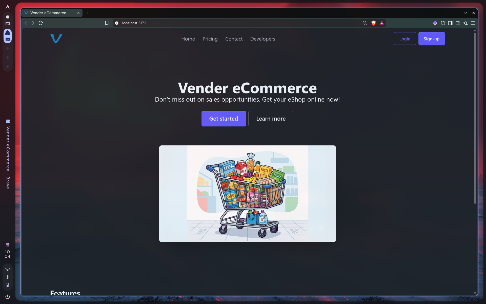

# Shopfront-React

This is the frontend page for [Shopfront](https://github.com/tyqualters/shopfront).

## Progress

- [x] Basic Routes
- [x] `<AuthWrapper />`
- [x] /dashboard routes
- [ ] /api/whoami req struct def
- [ ] /api/shops route
- [ ] Functional dashboard

## Tech Stack

- Node.js
- TypeScript
- Vite
- React
- React-Router
- TailwindCSS

## Building

First run `npm i` to install all the dependencies.

Then, for a dev spin-up use `npm run dev` and for a prod build use `npm run build`.

Prod builds should only add files under build/client to the web server.
